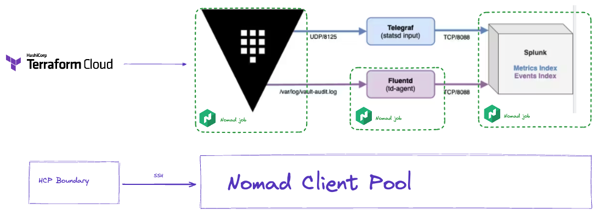

# Vault and Splunk Demo

  

## Overview
This demo will deploy Vault, Splunk and Fluentd on Nomad. The demo can be used to show how Vault's audit log counts clients.

TFC is used to deploy the Nomad jobs. The TFC run authenticates to HCP Vault with DPC to retrieve a Nomad token to deploy the Nomad jobs. TFC also reads the Vault root token to use when deploying the Nomad job from HCP Vault. The Nomad jobs are automatically added to the consul service mesh. Create an intention to allow Fluentd to communicate with the Splunk event service in Consul.

## Running the demo
The 0_control-workspace will deploy 9_splunk-tf workspace in TFC. Initiate a run of the 9_splunk-tf workspace from the TFC UI to build the splunk demo. The workspace will output VAULT_ADDR and Splunk UI address. Log into splunk with admin / lvm-password. (TODO: move password to HCP Vault)

Self-hosted Vault retrieves a root token stored in HCP Vault. TFC uses dynamic provider credentials to authenticate to HCP Vault. The vault token is created from a TF environment variable in 5_nomad_cluster. An alternative way to do this would be to give the Nomad job permissions to read the secret from Vault.

The nomad provider needs a nomad token and nomad address. The nomad token is stored in HCP, TFC is able to authenticate using DPC to retrieve the nomad token. Using workspace outputs, we get the nomad address.

The nomad jobs are automatically added to the consul service mesh.

In Splunk UI: Settings > Indexes > vault-audit should not have events until the intention is created in Consul and there is audit log activity.

I had originally built this demo to include Vault metrics with Telegraf, however Consul service mesh does not support UDP so I had to remove that portion from the demo.

## Create some Vault users
```shell
vault auth enable userpass
for i in {1..10}
  do
    printf "."
    vault write auth/userpass/users/learner$i password=vtl-password token_ttl=120m token_max_ttl=140m token_policies=sudo
done
for i in {1..10}
  do
    printf "."
    vault login -method=userpass username=learner$i password=vtl-password >> step4.log 2>&1
    vault secrets list >> step4.log 2>&1
done
```

## Run a splunk query
```shell
index="vault-audit"  sourcetype="hashicorp_vault_audit_log" auth.accessor=* auth.entity_id=* response.mount_point="auth/userpass/"
| eval month = strftime(_time, "%B %Y")
| stats dc(auth.entity_id) as entity_count , first(_time) as last_event,last(_time) as first_event by sourcetype
| eval StartTime=strftime(first_event, "%Y-%m-%dT%H:%M:%S")
| eval EndTime=strftime(last_event, "%Y-%m-%dT%H:%M:%S")
```