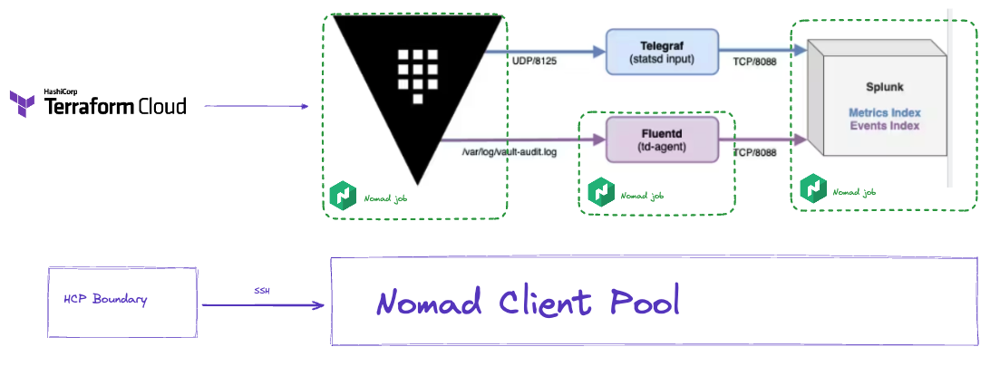

# Vault and Splunk Demo

  

## Overview
This demo will deploy Vault, Splunk and Fluentd on Nomad. The demo can be used to show how Vault's audit log counts clients. Unlike the demo in the splunk-tf directory, this demo does not use TFC to deploy the Nomad jobs. Instead, you will deploy the Nomad jobs manually using your CLI. The Nomad jobs are automatically added to the consul service mesh. Create an intention to allow Fluentd to communicate with the Splunk event service in Consul.

## Running the demo
Get the NOMAD_ADDR from WS6 output, and NOMAD_TOKEN from HCP Vault KV
```shell
export NOMAD_ADDR="NOMAD_ADDRESS_HERE"
export NOMAD_TOKEN='NOMAD_TOKEN_HERE'
```
### Deploy Vault
```shell
nomad run 1-demo-vault.nomad.hcl
```

#### Get Vault token from Nomad UI logs > stdout
```shell
export VAULT_ADDR=http://$(nomad node status -json $(nomad node pool nodes -json x86 | jq -r ".[0].ID") | jq -r '.Attributes."unique.platform.aws.public-ipv4"'):8204
export VAULT_ADDR=http://$(nomad node status -json $(nomad node pool nodes -json x86 | jq -r ".[0].ID") | jq -r '.Attributes."unique.platform.aws.public-hostname"'):8204
echo $VAULT_ADDR
export VAULT_TOKEN=hvs.GQUqx98NJ1fg8rmd5nEkExqp
vault audit enable file file_path=/vault/logs/vault-audit.log
vault write sys/internal/counters/config enabled=enable
```

### Deploy Splunk
```shell
nomad run 2-demo-splunkv2.nomad.hcl 
echo SPLUNK_URL=https://$(nomad node status -json $(nomad node pool nodes -json x86 | jq -r ".[0].ID") | jq -r '.Attributes."unique.platform.aws.public-hostname"'):8443
Connect to splunk over web UI - admin / lvm-password - https://ec2-54-234-235-178.compute-1.amazonaws.com:8443/
```
If splunk deploys properly, the last line in the logs should be: "Ansible playbook complete, will begin streaming var/log/splunk/splunkd_stderr.log"

### Deploy Fluentd
Because we are using Consul service mesh, the fluentd config can use "127.0.0.1" instead of "{{env "attr.unique.platform.aws.public-ipv4"}}"
```shell
nomad run 3-demo-fluentd.nomad.hcl
```
### Deploy Telegraf
```shell
nomad run 4-demo-telegraf.nomad.hcl 
```

### Generate some Vault usage
```shell
vault secrets enable -version=2 kv
for i in {1..10}
  do
    printf "."
    vault kv put kv/$i-secret-10 id="$(uuidgen)" >> step4.log 2>&1
done
for i in {1..10}
  do
    printf "."
    vault kv put kv/$i-secret-10 id="$(uuidgen)" >> step4.log 2>&1
done
vault policy write sudo - << EOT
// Example policy: "sudo"
path "*" {
  capabilities = ["create", "read", "update", "delete", "list", "sudo"]
}
EOT
vault auth enable userpass
vault write auth/userpass/users/learner \
  password=vtl-password \
  token_ttl=120m \
  token_max_ttl=140m \
  token_policies=sudo
for i in {1..10}
  do
    printf "."
    vault login \
      -method=userpass \
      username=learner \
      password=vtl-password >> step4.log 2>&1
done
for i in {1..20}
  do
    printf "."
    vault token create -policy=default >> step4.log 2>&1
done
for i in {1..10}
  do
    printf "."
    vault write auth/userpass/users/learner$i password=vtl-password token_ttl=120m token_max_ttl=140m token_policies=sudo
done
for i in {1..10}
  do
    printf "."
    vault login -method=userpass username=learner$i password=vtl-password >> step4.log 2>&1
    vault secrets list >> step4.log 2>&1
done
```

### Splunk commands
Search & Reporting > Analytics > Metrics > Vault
Search & Reporting > In Search bar, can put commands below
### Clients
```shell
index="vault-audit"  sourcetype="hashicorp_vault_audit_log" auth.accessor=* auth.entity_id=*
| eval month = strftime(_time, "%B %Y")
| stats dc(auth.entity_id) as entity_count , first(_time) as last_event,last(_time) as first_event by sourcetype
| eval StartTime=strftime(first_event, "%Y-%m-%dT%H:%M:%S")
| eval EndTime=strftime(last_event, "%Y-%m-%dT%H:%M:%S")
| appendcols
  [ search index="vault-audit" sourcetype="hashicorp_vault_audit_log" auth.accessor=* NOT auth.entity_id=*
  | eval month = strftime(_time, "%b %Y")
  | stats dc(auth.accessor) as accessor_count by sourcetype]
| addtotals fieldname=Total entity_count, accessor_count
```
### Token TTLs
```shell
| mstats sum(vault.token.creation.value) AS count WHERE index=vault-metrics BY creation_ttl
```
### Tokens by mount point
```shell
| mstats sum(vault.token.creation.value) AS count WHERE index=vault-metrics AND cluster=vault-cluster-80c9165f AND creation_ttl=+Inf BY mount_point
```
### Retrieve secret from Vault as logged in user
```shell
VAULT_TOKEN="users_vault_token" vault kv get -mount=kv 2-secret-10
```
## Count how many times a user has accessed Vault
```shell
index="vault-audit"  sourcetype="hashicorp_vault_audit_log" auth.accessor=* auth.entity_id=* auth.display_name="userpass-learner10"
| eval month = strftime(_time, "%B %Y")
| stats count(auth.entity_id) as entity_count , first(_time) as last_event,last(_time) as first_event by sourcetype
```

## Count how many clients in an auth mount:
```shell
index="vault-audit"  sourcetype="hashicorp_vault_audit_log" auth.accessor=* auth.entity_id=* response.mount_point="auth/userpass2/"
| eval month = strftime(_time, "%B %Y")
| stats dc(auth.entity_id) as entity_count , first(_time) as last_event,last(_time) as first_event by sourcetype
| eval StartTime=strftime(first_event, "%Y-%m-%dT%H:%M:%S")
| eval EndTime=strftime(last_event, "%Y-%m-%dT%H:%M:%S")
```
## Count how many clients have logged into Vault, then used their token to actually do something in Vault
```shell
index="vault-audit"  sourcetype="hashicorp_vault_audit_log" request.client_id=*
| eval month = strftime(_time, "%B %Y")
| stats dc(auth.entity_id) as entity_count , first(_time) as last_event,last(_time) as first_event by sourcetype
| eval StartTime=strftime(first_event, "%Y-%m-%dT%H:%M:%S")
| eval EndTime=strftime(last_event, "%Y-%m-%dT%H:%M:%S")
```